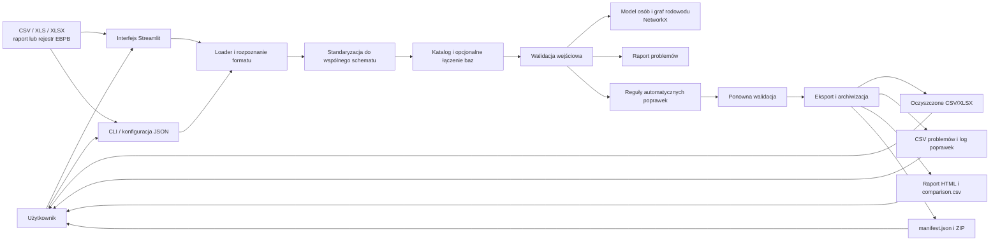
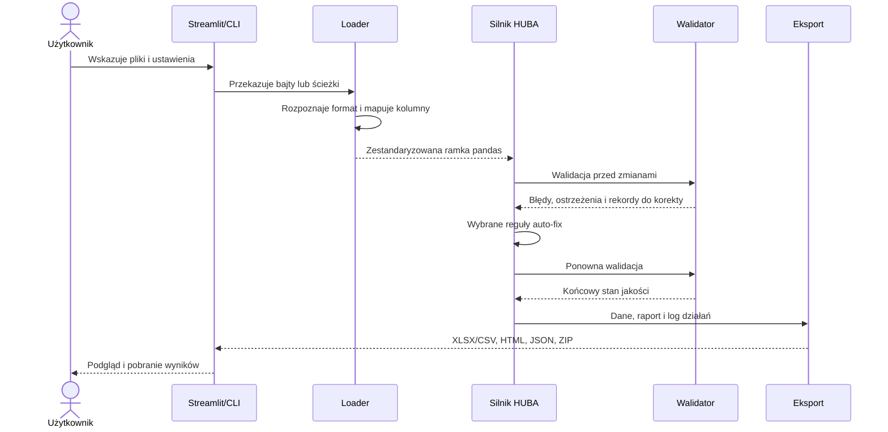

# WisentPedigree DataCleaner — przewodnik do prezentacji projektu

## 1. Projekt w jednym zdaniu

**WisentPedigree DataCleaner rozwiązuje problem niespójnych i błędnych baz rodowodowych żubrów EBPB: przyjmuje dane w różnych formatach, standaryzuje je, kontroluje jakość, wykonuje wybrane bezpieczne poprawki i eksportuje udokumentowany, oczyszczony zbiór gotowy do dalszej analizy rodowodowej.**

To zdanie warto powiedzieć na początku prezentacji. Pokazuje problem, odbiorcę, dane wejściowe i rezultat bez omawiania zbędnych szczegółów.

## 2. Problem i cel

### Problem

Dane rodowodowe mogą pochodzić z różnych eksportów EBPB, mieć odmienne nazwy i układ kolumn oraz zawierać m.in.:

- powtórzone albo puste identyfikatory;
- odwołania do rodziców, których nie ma w bazie;
- osobnika wskazanego jako własny rodzic;
- cykle w rodowodzie;
- ojca oznaczonego jako samica albo matkę oznaczoną jako samiec;
- niespójne daty, lata urodzenia i wiek rodziców;
- niezgodności linii rodowodowych;
- niepełne dane rodziców.

Takie problemy mogą prowadzić do błędnych analiz pokrewieństwa i inbredu. Ręczne sprawdzanie dużych arkuszy jest czasochłonne i trudne do powtórzenia.

### Cel

Celem projektu jest zautomatyzowanie przygotowania baz EBPB do dalszej analizy poprzez:

1. wczytanie raportu lub rejestru EBPB z CSV/XLS/XLSX;
2. sprowadzenie różnych formatów do jednego schematu danych;
3. opcjonalne połączenie kilku baz;
4. walidację struktury i relacji rodowodowych;
5. wykonanie wybranych reguł czyszczenia;
6. ponowną walidację i eksport danych, raportów oraz manifestu przebiegu.

### Zakres świadomie ograniczony

Głównym zadaniem aplikacji jest **przygotowanie i kontrola jakości danych**, a nie kompletna platforma hodowlana. Moduły analityczne dotyczące rodowodu są obecne w repozytorium i testach, ale bieżący interfejs HUBA skupia się na procesie DataCleaner. Ręczna edycja pojedynczych rekordów jest dostępna w Kroku 3, przelicza walidację po zapisie i pozwala cofnąć ostatnią zmianę w sesji.

## 3. Dwie wymagane części projektu

### A. Część integracyjna

Odpowiada za pozyskanie, przygotowanie i połączenie danych.

| Etap | Działanie | Główne miejsce w kodzie |
|---|---|---|
| Pozyskanie | Pliki lokalne, upload w przeglądarce lub ścieżki z konfiguracji JSON | `app/data/dataset_loader.py` |
| Rozpoznanie | Rozpoznanie raportu i rejestru EBPB | `app/data/ebpb_formats.py`, `dataset_loader.py` |
| Standaryzacja | Mapowanie pól do wspólnego, 16-kolumnowego schematu aplikacji; normalizacja ID, płci i linii | `app/data/dataset_loader.py` |
| Łączenie | Konkatenacja wielu zbiorów i jawna polityka duplikatów: pierwszy, ostatni albo wszystkie | `app/huba/modules/merge.py` |
| Walidacja | Kontrola rekordów, dat i relacji rodzic–potomstwo, w tym grafu rodowodu | `app/data/validator.py` |
| Transformacja | Sekwencyjne, konfigurowalne reguły automatycznych poprawek | `app/data/auto_fix.py` |
| Eksport | Oczyszczona baza, lista problemów, podsumowanie, log poprawek, raport HTML, porównanie i manifest | `app/huba/stages.py`, `app/huba/engine.py`, `app/huba/layout.py` |

Wspólny schemat obejmuje: `id`, nazwy osobnika, płeć, linię, rok i datę urodzenia, status, dane ojca i matki, datę śmierci oraz miejsce urodzenia. Rekord techniczny o ID `99999` może zostać pominięty.

### B. Część główna — aplikacja i interfejs

Interfejs webowy zbudowano w Streamlit. Użytkownik przechodzi przez pięć kroków:

1. **Wczytanie danych** — dodanie plików, podgląd katalogu zbiorów i opcjonalne łączenie.
2. **Walidacja** — kategorie problemów, status jakości, tabele i wykresy podsumowujące.
3. **Czyszczenie automatyczne** — wybór baz, reguł, formatu eksportu i opcjonalnej konfiguracji JSON.
4. **Czyszczenie ręczne** — wybór rekordu z raportu, edycja pól, ponowna walidacja i cofnięcie ostatniej zmiany.
5. **Wyniki** — tabela rezultatów oraz pobranie raportu HTML, `comparison.csv`, `manifest.json` i całego katalogu ZIP.

Aplikacja ma również tryb terminalowy. Ta sama logika przetwarzania jest dzięki temu dostępna z GUI, CLI oraz konfiguracji JSON.

## 4. Architektura rozwiązania



### Zależności między warstwami

- `app/ui/` wywołuje logikę aplikacji, ale nie implementuje reguł domenowych.
- `app/huba/` steruje potokiem i przekazuje kontekst pomiędzy etapami.
- `app/data/` odpowiada za import, schemat, walidację i poprawki.
- `app/pedigree/` buduje model osób i relacji rodowodowych.
- `app/analytics/` zawiera algorytmy pokrewieństwa i inbredu wykorzystywane oraz testowane niezależnie od UI.
- `pandas` i `openpyxl` obsługują dane tabelaryczne i Excel, `NetworkX` graf rodowodu, `Streamlit` interfejs, a `Matplotlib` wykresy.

## 5. Przepływ danych krok po kroku



Istotna cecha: plik źródłowy nie jest nadpisywany. Poprawki wykonywane są na kopii ramki danych, a rezultat trafia do osobnego katalogu `outputs/<nazwa_projektu>/`.

## 6. Najważniejsze decyzje projektowe

- **Jeden schemat wewnętrzny** odcina dalszą logikę od różnic między eksportami EBPB.
- **Etapy `load → validate → transform → export`** są jawne i rozszerzalne przez rejestr etapów.
- **Walidacja przed i po transformacji** pozwala ocenić wpływ poprawek.
- **Reguły są przełączalne**, ponieważ automatyczne usuwanie informacji rodowodowej może być decyzją domenową.
- **Log i manifest** zapewniają powtarzalność oraz możliwość sprawdzenia, co aplikacja zmieniła.
- **GUI i CLI korzystają z tego samego silnika**, więc logika nie jest powielona.
- **Deterministyczna obsługa duplikatów** pozwala świadomie zachować pierwszy, ostatni lub każdy rekord.

## 7. Podstawowe funkcjonalności

- import wielu plików CSV/XLS/XLSX;
- obsługa raportu i rejestru EBPB;
- automatyczne mapowanie do schematu aplikacji;
- łączenie wielu baz;
- wykrywanie duplikatów i braków ID;
- wykrywanie brakujących rodziców, self-parent, identycznego ojca i matki oraz cykli;
- kontrola płci rodziców, zakresu lat, wieku rodziców, dat i linii rodowodowych;
- eksport rekordów wymagających korekty do CSV;
- automatyczne, wybieralne poprawki wraz z logiem;
- ponowna walidacja po czyszczeniu;
- eksport oczyszczonego zbioru do XLSX albo CSV;
- raport HTML, porównanie zbiorów, manifest JSON i archiwum ZIP;
- praca przez przeglądarkę albo terminal.

## 8. Instrukcja uruchomienia

### Wymagania

- Python 3.10 lub nowszy;
- Windows, macOS albo Linux.

### Instalacja i start GUI

```bash
cd zubry_pedigree_app
python3 -m venv .venv
source .venv/bin/activate
pip install -r requirements.txt
python3 run_web.py
```

W Windows aktywacja środowiska to `.venv\Scripts\activate`.

Alternatywnie sam serwer Streamlit można uruchomić poleceniem:

```bash
python3 run_streamlit.py
```

### Tryb terminalowy

```bash
python3 run_cli.py run --input data/EBPB_bison_report.xlsx --project-name egzamin_demo
```

### Tryb konfigurowany plikiem JSON

```bash
python3 app/main.py --project-config config/huba_project.example.json
```

## 9. Repozytorium Git — co omówić

Repozytorium: `https://github.com/CherryBison84/RodowodyAPP`

Podczas prezentacji pokaż:

1. **strukturę katalogów** — osobne warstwy danych, potoku, rodowodu, analityki, UI i testów;
2. **historię rozwoju** — przejście od aplikacji rodowodowej do uporządkowanego modułu HUBA/DataCleaner, kolejne wersje i dodanie CLI;
3. **małe, opisowe commity** — przykład: import EBPB, walidacja, auto-poprawki, przebudowa HUBA, wersja terminalowa;
4. **testy** — loader obu formatów, mapowanie pól oraz obliczenia pokrewieństwa;
5. **README** — wymagania, instalację, uruchomienie i strukturę;
6. **brak danych wynikowych w repozytorium** — `outputs/` powstaje lokalnie.

Wersja wydania jest spójnie zapisana jako `1.2.0` w README i `pyproject.toml`.

Nie prezentuj repozytorium z niezatwierdzonymi przypadkowymi zmianami. Przed egzaminem sprawdź stan Git, nazwę bieżącej gałęzi oraz czy commit widoczny w MS Teams odpowiada commitowi na GitHubie.

## 10. Testowanie i weryfikacja

Testy są napisane dla `pytest`. Po zainstalowaniu narzędzia uruchamia się je z katalogu `zubry_pedigree_app`:

```bash
python3 -m pip install -r requirements-dev.txt
python3 -m pytest -v
```

`pytest` jest zadeklarowany w `requirements-dev.txt` oraz w opcjonalnych zależnościach `test` pliku `pyproject.toml`.

Zakres automatycznych testów obejmuje:

- rozpoznawanie raportu i rejestru EBPB;
- mapowanie obu formatów do schematu aplikacji;
- łączenie miejsca i kraju urodzenia;
- współczynnik pokrewieństwa Φ;
- relację `R = 2Φ`;
- średnie pokrewieństwo i dekompozycję relacji.

Przed prezentacją wykonaj również krótki test manualny: wczytaj plik przykładowy, pokaż walidację, uruchom jedną lub dwie reguły czyszczenia i pobierz ZIP z wynikami.

## 11. Wykorzystanie sztucznej inteligencji

### Gotowy, uczciwy opis

> Narzędzia generatywnej sztucznej inteligencji, w tym Codex, były używane jako wsparcie w pracy programistycznej: do porządkowania struktury projektu, proponowania i przeglądu kodu, dokumentacji oraz testów. Każda zmiana była weryfikowana na podstawie kodu, uruchomienia aplikacji i testów. AI nie jest elementem działania aplikacji: dane rodowodowe nie są wysyłane do modelu, model nie waliduje rekordów i nie podejmuje decyzji hodowlanych. Walidacja i czyszczenie są deterministycznymi regułami zapisanymi w Pythonie.

Do wersji oddawanej prowadzący może wymagać podania nazw modeli lub narzędzi. Wtedy należy wpisać tylko faktycznie użyte pozycje, np. nazwę usługi, modelu, IDE i zakres pomocy. Nie należy przypisywać AI autorstwa wyników naukowych ani deklarować modelu, którego nie użyto.

### Co było weryfikowane przez człowieka

- zgodność mapowania pól ze strukturą EBPB;
- sens reguł walidacji i wartości progowych;
- wpływ automatycznych poprawek na dane;
- poprawność uruchomienia aplikacji;
- testy i czytelność raportów;
- zgodność dokumentacji z bieżącym kodem.

### Ograniczenia i odpowiedzialność

Automatyczna poprawka może usuwać podejrzane powiązanie, ale nie potrafi odtworzyć prawdziwej informacji biologicznej. Wynik powinien być sprawdzony przez osobę posiadającą wiedzę domenową. Aplikacja wspiera kontrolę jakości; nie zastępuje eksperta i nie podejmuje decyzji o kojarzeniach.

## 12. Proponowany przebieg prezentacji — 7–10 minut

1. **Problem i odbiorca — 45 s**
   „Różne eksporty EBPB i błędy relacji utrudniają wiarygodną analizę rodowodu.”
2. **Cel i rezultat — 30 s**
   „Aplikacja tworzy zestandaryzowany, zwalidowany i udokumentowany zbiór.”
3. **Część integracyjna — 90 s**
   Pokaż dwa pliki wejściowe, wspólny schemat, łączenie i reguły walidacji.
4. **Architektura — 90 s**
   Omów diagram od interfejsu przez silnik HUBA do eksportu.
5. **Demo — 2–3 min**
   Wczytaj przykład → pokaż problemy → wybierz auto-fix → pobierz raport/ZIP.
6. **Git i testy — 60 s**
   Pokaż strukturę, kilka kluczowych commitów oraz wynik testów.
7. **AI, ograniczenia i rozwój — 45 s**
   Wyjaśnij rolę AI, działanie ręcznej edycji i potrzebę nadzoru eksperta.

## 13. Pytania, które mogą paść na egzaminie

**Dlaczego nie pracować bezpośrednio w Excelu?**
Ponieważ kod zapewnia powtarzalne mapowanie, te same kontrole dla każdego pliku, ponowną walidację i ślad wykonanych zmian.

**Dlaczego użyto pandas?**
Ponieważ dane wejściowe są tabelaryczne, a biblioteka dobrze obsługuje import, transformacje, deduplikację i eksport.

**Po co NetworkX?**
Rodowód jest grafem skierowanym. Biblioteka ułatwia wykrywanie cykli i pracę z relacjami przodek–potomek.

**Czy aplikacja zmienia plik źródłowy?**
Nie. Pracuje na kopii danych i zapisuje nowe artefakty w osobnym katalogu wynikowym.

**Co się dzieje z duplikatem ID?**
Przy łączeniu użytkownik wybiera zachowanie pierwszego, ostatniego lub wszystkich rekordów. W auto-fix domyślnie można pozostawić pierwszy rekord. Operacja jest odnotowana w logu.

**Czy każda automatyczna poprawka jest bezpieczna?**
Nie w sensie biologicznym. Dlatego reguły są wybieralne, raportowane i wymagają oceny eksperta.

**Dlaczego są dwie walidacje?**
Pierwsza opisuje stan wejściowy, druga sprawdza rezultat po transformacji i pozwala wykazać efekt czyszczenia.

**Czy AI analizuje dane żubrów?**
Nie. AI wspierało proces tworzenia kodu, ale aplikacja działa lokalnie według jawnych, deterministycznych reguł.

**Jak można rozwinąć projekt?**
Dodać formalny schemat konfiguracji JSON, dalsze testy interfejsu oraz wersjonowanie zestawu reguł czyszczenia.

## 14. Lista kontrolna przed oddaniem

- [ ] Projekt w MS Teams zawiera aktualny kod lub link do właściwego commita.
- [ ] `README.md` ma działającą instrukcję instalacji i uruchomienia.
- [ ] Diagram architektury renderuje się poprawnie.
- [ ] Numer wersji jest spójny w commicie, README i `pyproject.toml`.
- [ ] Nie ma przypadkowych, niezatwierdzonych zmian ani danych poufnych.
- [ ] Testy automatyczne przechodzą.
- [ ] Zależność `pytest` jest opisana i możliwa do zainstalowania na czystym środowisku.
- [ ] Aplikacja uruchamia się na czystym środowisku.
- [ ] Pliki przykładowe działają w demonstracji.
- [ ] Można pobrać oczyszczoną bazę, raport HTML, manifest i ZIP.
- [ ] Prezentacja jasno rozdziela część integracyjną od aplikacji.
- [ ] Opis AI zawiera tylko faktycznie użyte narzędzia i modele.
- [ ] Ograniczenia są nazwane wprost, w tym konieczność kontroli eksperckiej po automatycznych poprawkach.

## 15. Najkrótsze podsumowanie końcowe

> Projekt dostarcza kompletny, powtarzalny proces przygotowania danych rodowodowych: od importu różnych plików EBPB, przez standaryzację, łączenie, walidację i kontrolowane czyszczenie, aż po raportowany eksport. Rozdzielenie interfejsu, potoku integracyjnego i logiki domenowej ułatwia testowanie i dalszy rozwój. Najważniejszą wartością nie jest liczba funkcji, lecz wiarygodny i możliwy do prześledzenia wynik.
