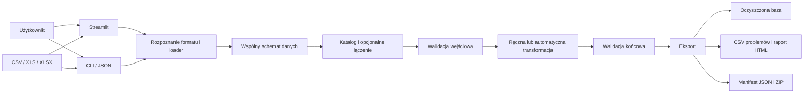

# WisentPedigree Pro+ (RodowodyAPP)

**Wersja aplikacji (pakiet): 1.0.0**

**HUBA-WPB Cleaner** — aplikacja **webowa (Streamlit)** do wczytywania baz rodowodowych żubrów, **walidacji** (wykresy podsumowań, eksport CSV), **automatycznych poprawek** i eksportu oczyszczonych plików. Interfejs i treści pomocy są po polsku.

Kod źródłowy: katalog **`zubry_pedigree_app/`**.

## Wymagania

- Python **3.10+** (zalecany 3.11–3.14)
- Windows, macOS lub Linux

## Instalacja

```bash
cd zubry_pedigree_app
python3 -m venv .venv
source .venv/bin/activate   # Windows: .venv\Scripts\activate
pip install -r requirements.txt
```

## Uruchomienie

**Zalecane** — Streamlit z wyborem portu i otwarciem przeglądarki:

```bash
cd zubry_pedigree_app
python3 run_web.py
```

Tylko serwer Streamlit:

```bash
python3 run_streamlit.py
```

Z katalogu głównego repozytorium:

```bash
python3 run_streamlit.py
```

Tryb wsadowy (bez UI):

```bash
cd zubry_pedigree_app
python3 app/main.py --project-config config/huba_project.example.json
```

## Wersja terminalowa bez GUI

DataCleaner może działać całkowicie z terminala, bez uruchamiania Streamlit.

Przetworzenie jednego pliku:

```bash
cd zubry_pedigree_app
python3 run_cli.py run --input data/EBPB_bison_report.xlsx --project-name test_terminal
```

Przetworzenie kilku plików:

```bash
python3 run_cli.py run --input data/EBPB_bison_report.xlsx data/EBPB_register.xlsx --project-name pakiet_terminal
```

Praca z konfiguracją JSON:

```bash
python3 run_cli.py init-config config/datacleaner_cli.example.json
python3 run_cli.py run --config config/datacleaner_cli.example.json
```

Wyniki trafiają do `outputs/<nazwa_projektu>/`. W terminalu pojawia się krótkie podsumowanie, a w katalogu wynikowym powstają między innymi `comparison.csv`, `final_report.html`, `manifest.json` i oczyszczone bazy w podkatalogu `datasets/`.

Na macOS, przy problemach z obserwatorem plików: `STREAMLIT_SERVER_FILE_WATCHER_TYPE=none`.

## Nawigacja w aplikacji (HUBA)

1. **Krok 1 — Wczytanie danych** — upload CSV/XLSX, katalog plików, łączenie zbiorów.
2. **Krok 2 — Walidacja** — kategorie kontroli, wykresy, eksport CSV z problemami.
3. **Krok 3 — Czyszczenie ręczne** — edycja pojedynczych rekordów z ponowną walidacją i możliwością cofnięcia ostatniej zmiany.
4. **Krok 4 — Czyszczenie automatyczne** — reguły auto-poprawek i uruchomienie projektu wsadowego.
5. **Krok 5 — Wyniki** — pobranie oczyszczonych plików i archiwum ZIP.

W widoku walidacji dostępna jest zwinięta pomoc opisująca wykonywane kontrole.

## Dane i dokumentacja

- Przykładowa baza: **`zubry_pedigree_app/data/EBPB_bison_report.xlsx`**
- Metryki (F, RIA, GI…): **`zubry_pedigree_app/docs/metrics_definition.md`**

## Zależności

Zobacz **`zubry_pedigree_app/requirements.txt`**: Streamlit, pandas, numpy, matplotlib, networkx, openpyxl, Pillow.

## Struktura repozytorium

| Element | Opis |
|--------|------|
| `zubry_pedigree_app/app/huba/` | Silnik wsadowy i etapy przetwarzania |
| `zubry_pedigree_app/app/ui/streamlit/` | Interfejs HUBA |
| `zubry_pedigree_app/run_web.py` | Start z przeglądarką |
| `run_streamlit.py` (root) | Start z katalogu głównego repo |

## Problem i podział projektu

Projekt rozwiązuje konkretny problem jakości baz rodowodowych: różne eksporty EBPB mogą mieć
odmienny układ kolumn oraz niespójne identyfikatory, relacje rodzic–potomstwo, płeć i daty.
Niepoprawne dane mogą zniekształcić późniejsze obliczenia rodowodowe.

**Część integracyjna** rozpoznaje format wejścia, mapuje raport i rejestr EBPB do wspólnego
schematu, opcjonalnie łączy zbiory, waliduje je, stosuje wybrane transformacje i eksportuje
wynik wraz z raportem oraz manifestem.

**Część główna** to aplikacja Streamlit prowadząca użytkownika przez wczytanie, walidację,
ręczne lub automatyczne czyszczenie oraz pobranie wyników. Ten sam silnik jest dostępny przez CLI.

## Architektura i przepływ danych



Potok wsadowy ma etapy `load → validate → transform → export`. Plik źródłowy nie jest
nadpisywany. Manifest zapisuje konfigurację, wersję aplikacji, czas, identyfikację wejścia SHA-256
oraz wynik walidacji przed i po transformacji.

## Testy

```bash
cd zubry_pedigree_app
pip install -r requirements-dev.txt
python -m pytest -v
```

Testy obejmują import obu formatów EBPB, walidator, reguły auto-poprawek, łączenie zbiorów,
konfigurację JSON, silnik HUBA, artefakty wynikowe, CLI oraz obliczenia rodowodowe.

## Wykorzystanie sztucznej inteligencji

Narzędzia generatywnej AI, w tym Codex, były wykorzystywane jako wsparcie pracy programistycznej:
do porządkowania kodu, dokumentacji, przeglądu implementacji i przygotowania testów. Zmiany były
weryfikowane poprzez analizę kodu, uruchomienie aplikacji i testy.

AI nie jest elementem działania DataCleaner. Dane użytkownika nie są wysyłane do modelu,
a walidacja i czyszczenie korzystają z jawnych, deterministycznych reguł Pythona. Model nie
podejmuje decyzji hodowlanych; końcowy wynik wymaga oceny osoby posiadającej wiedzę domenową.

## Autorka

**[Magdalena Perlińska-Teresiak](https://github.com/CherryBison84)** — [profil w bazie wiedzy SGGW](https://bw.sggw.edu.pl/info/author/WULS3c538856ad724c8ab12824cb5666f3f1?r=author&tab=&title=Profil%2Bosoby%2B%25E2%2580%2593%2BMagdalena%2BPerli%25C5%2584ska-Teresiak%2B%25E2%2580%2593%2BSzko%25C5%2582a%2BG%25C5%2582%25C3%25B3wna%2BGospodarstwa%2BWiejskiego%2Bw%2BWarszawie&lang=pl) · [repozytorium na GitHubie](https://github.com/CherryBison84/RodowodyAPP) · 2026
